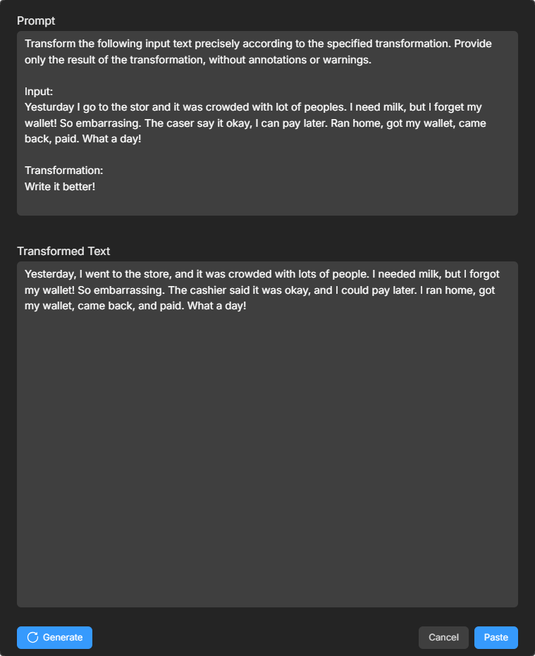

    

## Description
This is the public repository ofDeskAid that contains the official releases of DeskAid. DeskAid is an application designed to assist with various tasks while working on a desktop pc (currently only available for Windows, with macOS and Linux support planned) by leveraging the power of AI. At present, it enables you to generate, transform, and inquire about text using OpenAI's GPT-4o model. DeskAid can be used in any program that supports copying and pasting text via Ctrl+C / Ctrl+V and is activated by global hotkeys (see Usage). This ensures DeskAid is always instantly accessible when you need it, minimizing disruption to your workflow.

## Download Windows Installer
<a href="https://github.com/DeskAid/DeskAid/releases/latest/download/deskAId-Setup.exe">Download here</a>

## Installation
1. Set your OpenAI API key as the environment variable OPENAI_API_KEY. [Here](https://phoenixnap.com/kb/windows-set-environment-variable) you find a tutorial how to do this in Windows.
2. Download the installer from above and ruf DeskAid

## Screenshot

    

## Usage
Currently, the hotkeys are fix. In the future, it will be possible to change them in the configuration. The hotkeys are blocked for other programs until DeskAid is closed.

The following hotkeys are registered globally at program start by default:
- Alt+A: Show the menu
- Alt+T: Transform text

### Workflow
You can either use the menu or the hotkeys to transform text. When using the menu you just need to remember one hotkey (Alt+A). To be even faster, you can also call the functions directly using the other hotkeys (see above).

### Alt+T: Transform Text
Select some text in any program and press Alt+T. Complete the prompt and use the transformed text as described under "Alt+G: Generate Text".

### Changing the prompt
Feel free to adjust the prompts or even the prompt templates (prompt_library.py) to your needs.

### Prompting language
Currently the prompts are written in English and German. If your locale is set to German, the german prompts will be used. Otherwise the english prompts will be used.

## Upcoming features
- Create a beautiful UI
- Configurable hotkeys
- Adjust model and other parameters (e.g., Temperature)
- Manipulation of files and images
- Code Signing
- Create custom prompt templates
- Light mode and automatic mode setting
- Use fine-tuned model
- Support more languages for the prompt
- Support for macOS and Linux

